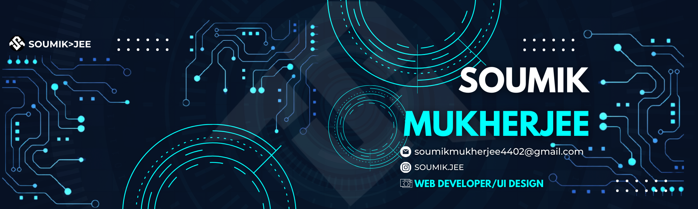

  

###

<h2 align="center">Hi 👋! My name is Soumik Mukherjee and I'm from India </h2>

###

<h3 align="center">Java Full Stack Developer and Backend Engineer</h3>

 I also have experience in Frontend, Mobile, ML and Security, Devops Technologies

###

<h2 align="center"> JAVA | DSA | HTML/CSS | SQL | FLUTTER | JAVASCRIPT </h2>

###

###

###

  

  
  
  
  
  
  
  
  
  
  
  
  
  
  
  
  
  
  
  
  
  
  
  
  
  
  
  
  
  
  
  
  
  
  
  
  
  
  
  
  
  
  
  
  
  
  
  
  
  
  
  
  
  
  
  
  
  
  
  
  
  
  
  
  
  
  
  
  
  
  
  
  
  
  
  
  
  
  
  
  
  
  
  
  
  

###

###

<h1 align="center">HELLO AND WELCOME 👋</h1>
<h1 align="center">I'm Soumik Mukherjee </h1>

###

- 📫 How to reach me *onlinekazama19@gmail.com* 

<!---
soumikjee/soumikjee is a ✨ special ✨ repository because its `README.md` (this file) appears on your GitHub profile.
You can click the Preview link to take a look at your changes.
--->
